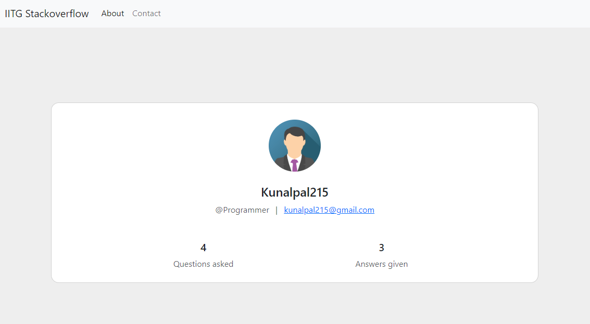

<br />
<p align="center"></p>

# StackLimit
#### StackLimit is a community based platform where users can post questions and answer to other's questions as well. Supporting image can also be uploaded with questions & answers. Also, every question has it's monthly and total views count attached.

## Live Demo
#### This project is deployed on Heroku which you can view at [StackLimit Website](https://stacklimit.herokuapp.com/) and view [ppt here](https://www.canva.com/design/DAFF49-0bHk/aEyEdeepZc3-sbK5RlnjVw/view?utm_content=DAFF49-0bHk&utm_campaign=designshare&utm_medium=link&utm_source=viewer)

## 🧩 Main Features
#### <ul><li>Hot & New Questions Category</li><li>Interactive discussion with Upvoting answers</li><li>Questions Total & Monthly views count</li><li>Image Upload with Questions and Answers</li></ul>

## 📖 Pages
#### <ul><li>Home Page</li><li>Profile Page</li><li>Add Question Page</li><li>Question Discussion Page</li><li>Login & SignUp Pages</li><li>404 Error Page</li></ul>

## 💻 TechStack Used
#### <ul><li>EJS</li><li>BootStrap</li><li>JavaScript</li><li>Node.js</li><li>Express</li><li>MongoDB</li></ul>

## Prerequisites
#### Node.js should be installed on your system
#### <ul><li>[Node.js](https://nodejs.org/en/)</li></ul>

## 🎪 Getting Started
```
First we need to configure a .env file for secret variables used

You need to add following two varaibles in your .env file:

1. MONGODB_URL : // This should be the connection URL of your MongoDB database (eg: mongodb+srv://<Username>:<Password>@cluster1.segmc.mongodb.net/iitgStackoverflow?retryWrites=true&w=majority)
2. JWT_SECRET : // This can be any string of your choice (eg: WeAreDevelopers)
```
#### <ul><li>Now in the root of project folder, we need to run the command : node server.js</li><li>Server should have started and headover to "http://localhost:3000" to see the project in working 🙌.</li></ul>

# 🖼️ Some glimpse of the website
## Signup Page

<br />

## Login Page

<br />

## HomePage

<br />

## Add Question Page

<br />

## Question Discussion Page

<br />

<br />

## Profile Page

<br />

## 404 Error Page

<br />
<br />

# 🐛 Bug Reporting
#### Feel free to [open an issue](https://github.com/Kunalpal215/stacklimit-community-QnA-platform/issues) on GitHub if you find any bug.

<br />

# ⭐ Feature Suggestion
#### Feel free to [open an issue](https://github.com/Kunalpal215/stacklimit-community-QnA-platform/issues) on GitHub if you have feature idea to be added 🙌.

```
Thanks for visiting my repository 😊!! Please give a star ⭐ if you liked my project.
```
